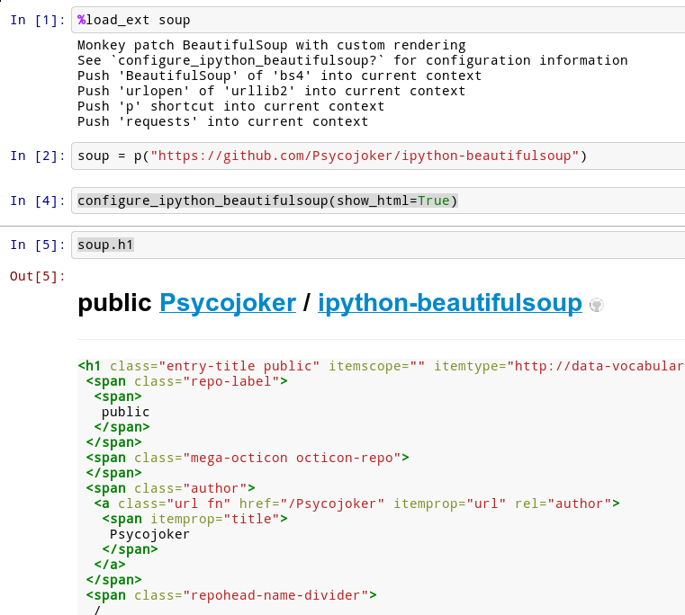

IPython-BeautifulSoup
=====================

IPython-BeautifulSoup is an IPython extension for displaying
BeautifulSoup HTML/XML objects as prettified and syntax highlighted HTML
blocks in IPython notebook and qtconsole.

Syntax highlighting is accomplished with Pygments.

Install
=======

Simply run:

::

    pip install "ipython-beautifulSoup[bs4]"

For BeautifulSoup 3 instead of BeautifulSoup 4, change ``bs4`` to
``bs3``.

Installing IPython Notebook
-----------------------------
See http://ipython.org/ipython-doc/stable/install/index.html

To install IPython notebook or qtconsole as well, append ``notebook``
and/or ``qtconsole`` to the extras specifier after "bs4" separated by a
",", like this:

::

    pip install "ipython-beautifulSoup[bs4,notebook,qtconsole]"

On Ubuntu LTS, if you want to install **IPython notebook**, you'll need
to do this before:

::

    sudo apt-get install python-dev g++

For the **qtconsole** do this (if you do this in a virtualenv) (WARNING:
it's slow):

::

    sudo apt-get install make cmake qt4-qmake libqt4-dev
    pip install pyside

Usage
=====

In IPython notebook or qtconsole, do:

::

    %load_ext soup

This will push a series of callables into your current context,
as well as a monkey-patched BeautifulSoup and requests.

You can now use BeautifulSoup like you would if it was imported from the
corresponding module.

There is great chances that you'll want to configure the output by using
``configure_ipython_beautifulsoup``, for example like this (just after the
``%load_ext``):

::

    configure_ipython_beautifulsoup(show_html=True, show_css=True, show_js=False)

To see ``configure_ipython_beautifulsoup`` documentation just do (in any
interface of IPython):

::

    configure_ipython_beautifulsoup?

This also loads a shortcut function called ``p`` (for
**p** arse) defined as follows:

::

    def p(url):
        if requests is not None:
            return BeautifulSoup(requests.get(url).contents)
        return BeautifulSoup(urlopen(url).read())

A note on security
==================

.. warning:: By nature of including external HTML, JS, and CSS,
   this extension is inherently unsafe if you choose to render the
   html by setting show_html to True when calling
   **configure_ipython_beautifulsoup**.

   By default, <script> and <link> and <style> tags are removed but this isn't
   a 100% guaranty that this is secure if you choose to render the html, use at
   your own risks.

The most safe option is to set all options of configure_ipython_beautifulsoup
to False (the default).

Screenshots
===========

IPython Notebook
------------------

``.find``:

.. figure:: 1.png
   :align: center
   :alt: 1

``.findAll``:

Contributors
============

In chronological order:

- `Astalaseven <https://github.com/Astalaseven>`_ - pull request: `#1 <https://github.com/Psycojoker/ipython-beautifulsoup/pull/1>`_
- `westurner <https://github.com/westurner>`_ - pull request: `#3
  <https://github.com/Psycojoker/ipython-beautifulsoup/pull/3>`_

Don't hesitate to add yourself.
